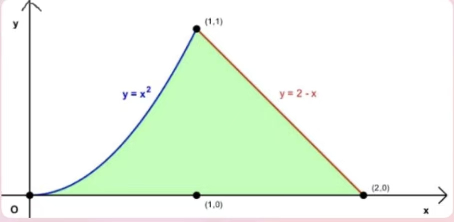

**某某学校 / 学年第  学期**

**级  各专业《测试》 课程期末试卷( 卷)**

**（考试形式：闭卷  考试时间：120分钟）**

**（参考答案与评分标准）**

**一、判断题（共1小题，每小题10.0分，共10分）**

**1**. 待补充

**二、选择题（共2小题，每小题10.0分，共20分）**

**1**. D  **2**. A

**三、填空题（共1小题，每小题10.0分，共10分）**

**1**. 3

**四、计算题（共4小题，每小题0.0分，共0分）**

**1**. 计算极限：$\lim_{x \to 0} \frac{\tan x - \sin x}{x^3}$
解：$$
\begin{aligned}  
\lim_{x \to 0} \frac{\tan x - \sin x}{x^3}  
&= \lim_{x \to 0} \frac{\sin x (1 - \cos x)}{x^3 \cos x} \\  
&= \lim_{x \to 0} \frac{x \cdot \frac{1}{2}x^2}{x^3} = \frac{1}{2}  
\end{aligned}  
$$

**2**. 计算 $\int{\sqrt{x}\left( {{x}^{2}}-\frac{1}{x} \right)}dx$.
解：$\int{\sqrt{x}\left( {{x}^{2}}-\frac{1}{x} \right)}dx=\int{\left( {{x}^{\frac{5}{2}}}-{{x}^{-\frac{1}{2}}} \right)}dx=\frac{2}{7}{{x}^{\frac{7}{2}}}-2\sqrt{x}+C$.

**3**. 计算 $\int_{0}^{4}{\frac{1}{\sqrt{2x+1}}}dx$.
解：$\int_{0}^{4}{\frac{1}{\sqrt{2x+1}}}dx=\frac{1}{2}\int_{0}^{4}{\frac{1}{\sqrt{2x+1}}}d\left( 2x+1 \right)=\left. \sqrt{2x+1} \right|_{0}^{4}=2$.

**4**. 计算 $\int_{0}^{\frac{\pi }{2}}{x\cos xdx}$.
解：原式$=\left. x\sin x \right|_{0}^{\frac{\pi }{2}}-\int_{0}^{\frac{\pi }{2}}{\sin xdx=\frac{\pi }{2}}+\left. \cos x \right|_{0}^{\frac{\pi }{2}}=\frac{\pi }{2}-1$.

**五、解答题（共1小题，每小题0.0分，共0分）**

**1**. 利用二阶导数讨论曲线$y={{x}^{3}}+3{{x}^{2}}-2$的凹凸性和拐点.
解：$y$在$\left( -\infty ,+\infty  \right)$上连续，${y}'=3{{x}^{2}}+6x$，${y}''=6x+6$；   （1分）
令${y}''=0$，得$x=-1$；   （1分）    
  列表:

| $x$ | $(-\infty, -1)$ | $(-1, +\infty)$ |
|:--:|:--:|:--:|
| $y''$ | - | + |
| $y$ | 凸 | 凹 | 

    拐点(-1,0). (2分)

**六、应用题（共1小题，每小题0.0分，共0分）**

**1**. 求由曲线$y={{x}^{2}}(x\ge 0)$和直线$x+y=2$及$x$轴所围成的平面图形的面积，
并求该图形绕$x$轴旋转一周所得旋转体的体积． 
解：由$$\left\{ \begin{array}{*{35}{l}}    y={{x}^{2}}  \\    x+y=2  \\ \end{array}} \right.$$ 得交点(-2,4)（舍）和(1,1),     （2分） 所以面积_A_=$\int_{0}^{1}{{{x}^{2}}dx}+\int_{1}^{2}{\left( -x+2 \right)dx}=\left. \frac{{{x}^{3}}}{3} \right|_{0}^{1}+\left. \left( -\frac{{{x}^{2}}}{2}+2x \right) \right|_{1}^{2}=\frac{5}{6}$    （3分） 体积_V_=$\int_{0}^{1}{\pi {{\left( {{x}^{2}} \right)}^{2}}dx}+\int_{1}^{2}{\pi {{\left( -x+2 \right)}^{2}}dx}=\left. \frac{\pi }{5}{{x}^{5}} \right|_{0}^{1}+\left. \pi \left( \frac{{{x}^{3}}}{3}-2{{x}^{2}}+4x \right) \right|_{1}^{2}=\frac{8}{15}\pi$  （3分）

**七、证明题（共1小题，每小题0.0分，共0分）**

**1**. 证明：当$x>1$时，$2\sqrt{x}>3-\frac{1}{x}$.
解：令$f\left( x \right)=2\sqrt{x}-\left( 3-\frac{1}{x} \right)$，则${f}'\left( x \right)=\frac{1}{{{x}^{2}}}\left( x\sqrt{x}-1 \right)$.   （2分）
$x>1$,${f}'\left( x \right)>0$,所以$f(x)$在$[1,+\infty )$上单调增加，     （2分）
因此$x>1$时，$f\left( x \right)>f\left( 1 \right)=0$ ，即当$x>1$时，$2\sqrt{x}>3-\frac{1}{x}$  （1分）

